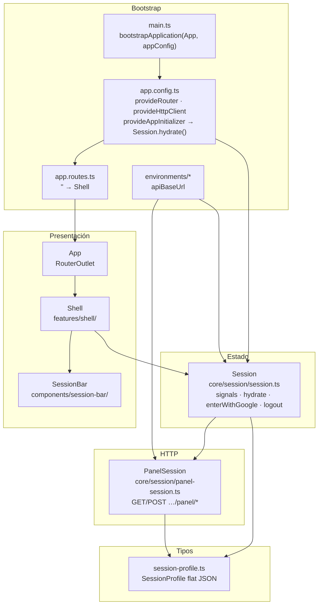
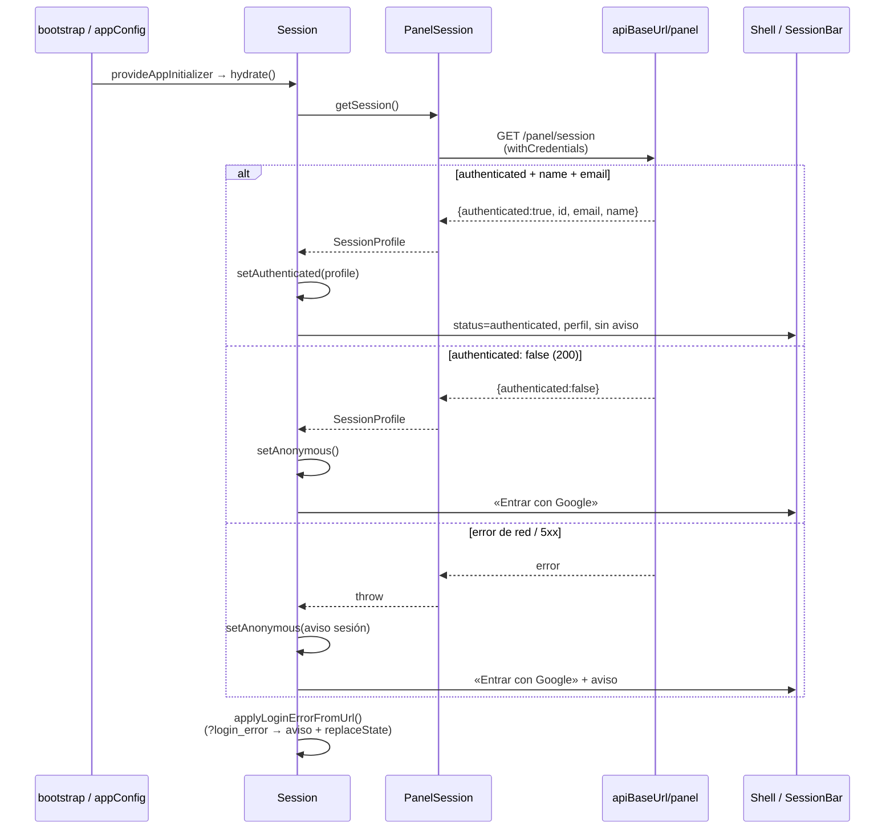
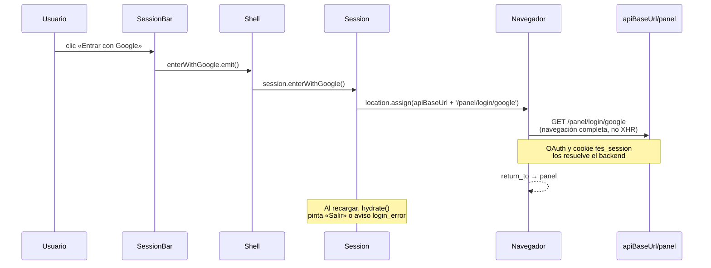
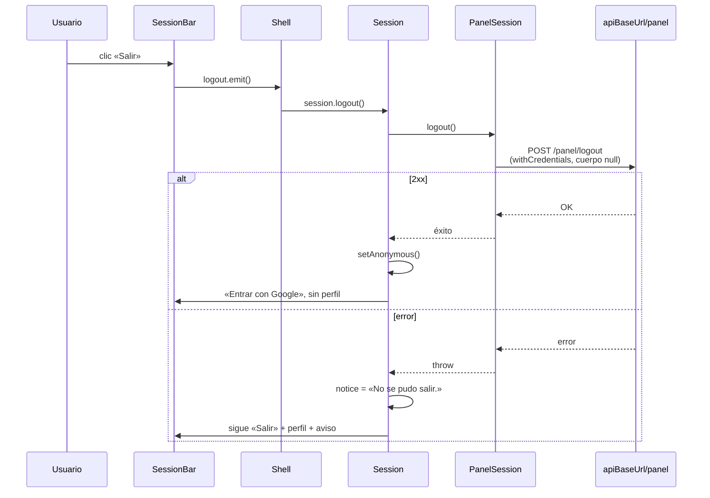

# UML 001 — Panel con entrada Google opcional

Diagramas alineados con el código real en la rama `001/feat-panel-google-login`.

**Configuración:** `apiBaseUrl` = `https://api.friendly-e-shop.duckdns.org` (mismo valor en `environment.ts` y `environment.development.ts`).

**JSON de sesión (plano):** `{ authenticated, id?, email?, name? }` — si `authenticated: true`, incluye `id`, `email` y `name`.

## Capas de componentes



## Estructura de carpetas (real)

```
src/
  main.ts
  styles.css                         # Tailwind v4 + Fira Sans / Fira Code
  environments/
    environment.ts                   # apiBaseUrl duckdns
    environment.development.ts       # mismo apiBaseUrl hoy
  app/
    app.config.ts                    # provideAppInitializer → hydrate
    app.routes.ts                    # '' → Shell
    app.ts / app.html                # raíz + RouterOutlet
    core/session/
      session.ts                     # estado (signals)
      panel-session.ts               # cliente HTTP
      session-profile.ts             # tipos JSON plano
    features/shell/
      shell.ts / shell.html
      components/session-bar/
        session-bar.ts / session-bar.html
```

## Secuencia: hidratar al arranque



## Secuencia: Entrar con Google



## Secuencia: Salir



## Contrato HTTP (solo `{apiBaseUrl}/panel/*`)

| Operación | Método | Path relativo |
|-----------|--------|---------------|
| Iniciar Google | GET (navegación) | `/panel/login/google` |
| Consultar sesión | GET | `/panel/session` |
| Cerrar sesión | POST | `/panel/logout` |

`{apiBaseUrl}` = `https://api.friendly-e-shop.duckdns.org`
