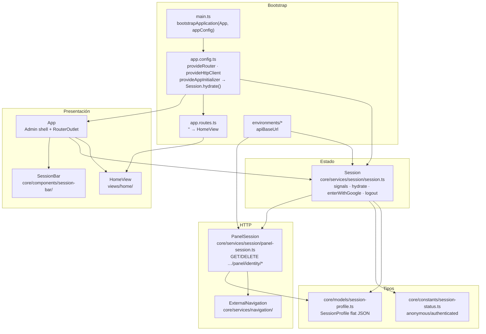
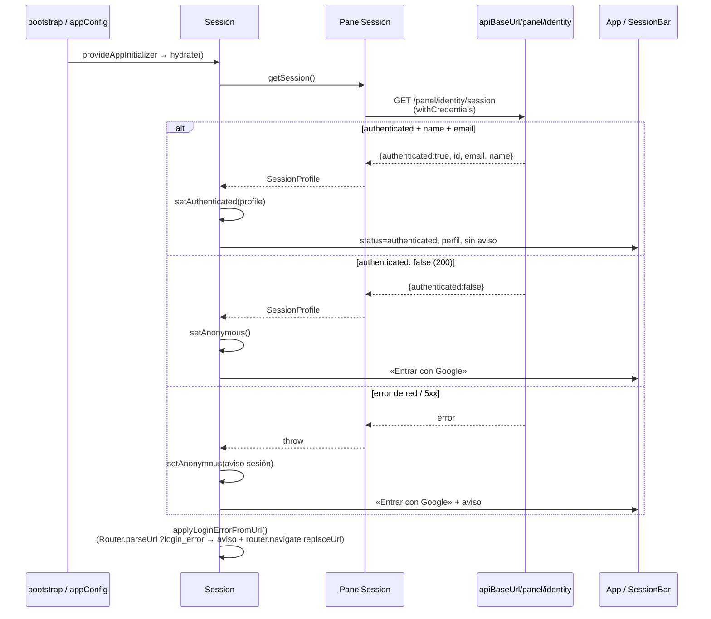
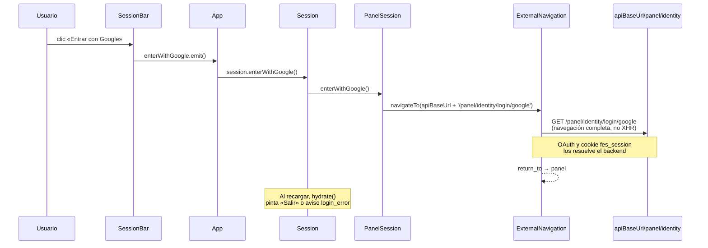
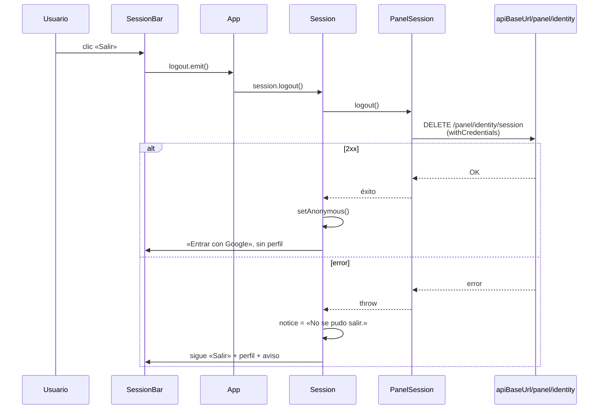

# UML 001 — Panel con entrada Google opcional

Diagramas alineados con el código real en la rama `001/feat-panel-google-login`.

Los diagramas priorizan relaciones arquitectónicas y de flujo; no intentan listar cada import, tipo local o dependencia transitiva ya explicada por el servicio de estado, el cliente HTTP o el componente dueño.

**Configuración:** `apiBaseUrl` = `https://api.friendly-e-shop.duckdns.org` (mismo valor en `environment.ts` y `environment.development.ts`).

**JSON de sesión (plano):** `{ authenticated, id?, email?, name? }` — si `authenticated: true`, incluye `id`, `email` y `name`.

## Capas de componentes



## Estructura de carpetas (real)

```
src/
  main.ts
  styles.css                         # Tailwind v4 + Fira Sans / Fira Code
  environments/
    environment.ts                   # apiBaseUrl duckdns
    environment.development.ts       # mismo apiBaseUrl hoy
  app/
    app.config.ts                    # provideAppInitializer → hydrate
    app.routes.ts                    # '' → HomeView
    app.ts / app.html                # shell Admin UI persistente + RouterOutlet
    core/
      components/session-bar/
        session-bar.ts / session-bar.html
      constants/session-status.ts
      models/session-profile.ts      # tipos JSON plano
      services/
        navigation/external-navigation.ts
        session/
          session.ts                 # estado (signals)
          panel-session.ts           # cliente HTTP
    views/home/
      home.ts / home.html
```

## Secuencia: hidratar al arranque



## Secuencia: Entrar con Google



## Secuencia: Salir



## Contrato HTTP (solo `{apiBaseUrl}/panel/identity/*`)

| Operación | Método | Path relativo |
|-----------|--------|---------------|
| Iniciar Google | GET (navegación) | `/panel/identity/login/google` |
| Consultar sesión | GET | `/panel/identity/session` |
| Cerrar sesión | DELETE | `/panel/identity/session` |

`{apiBaseUrl}` = `https://api.friendly-e-shop.duckdns.org`
