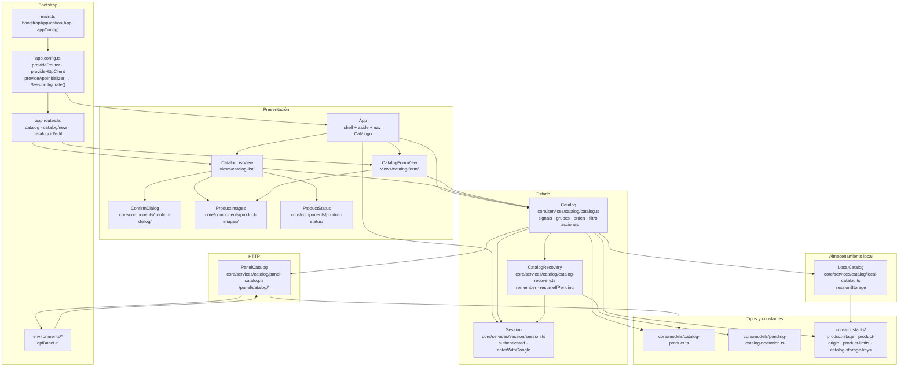
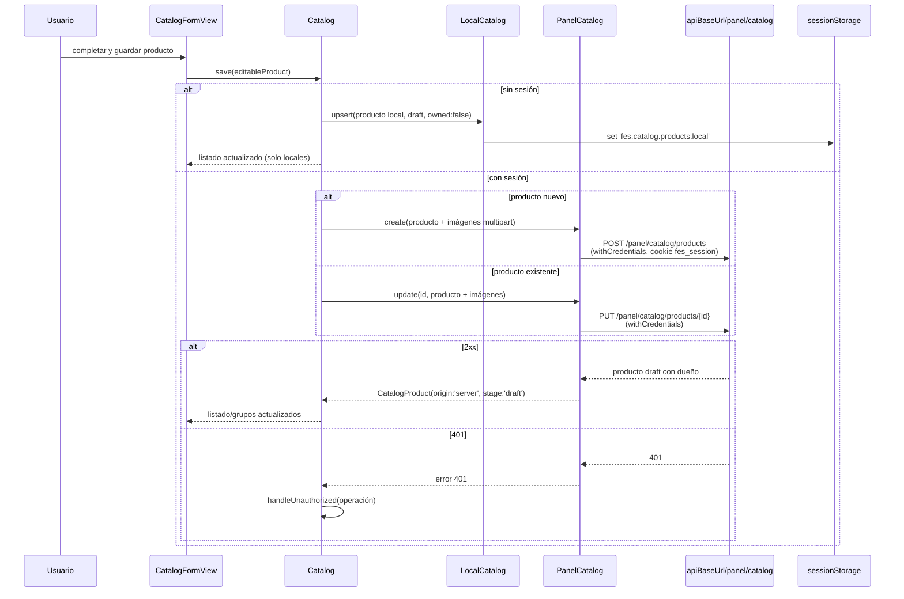
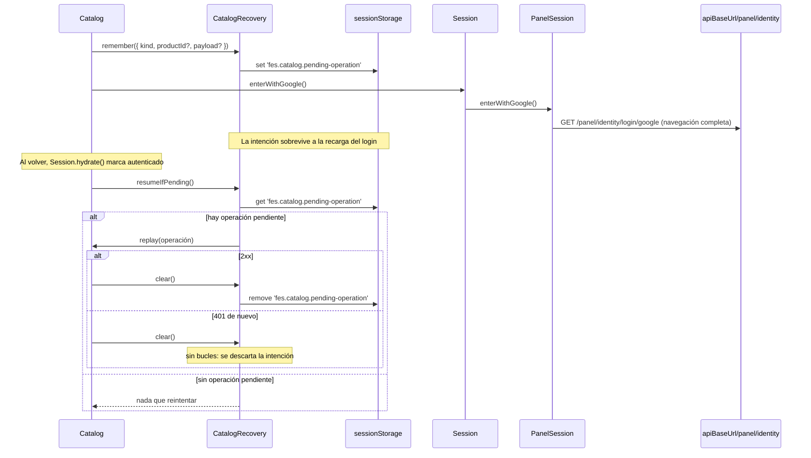
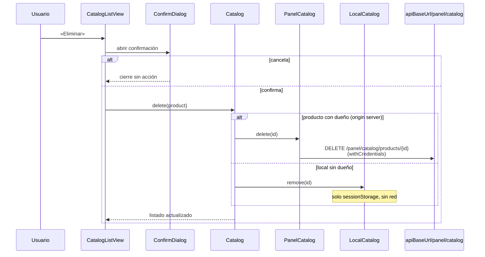
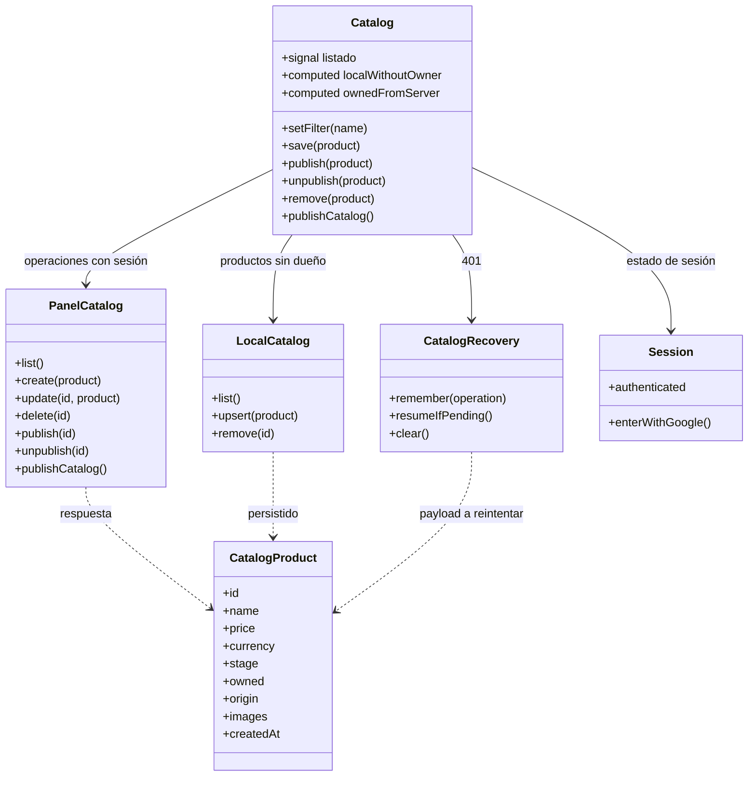
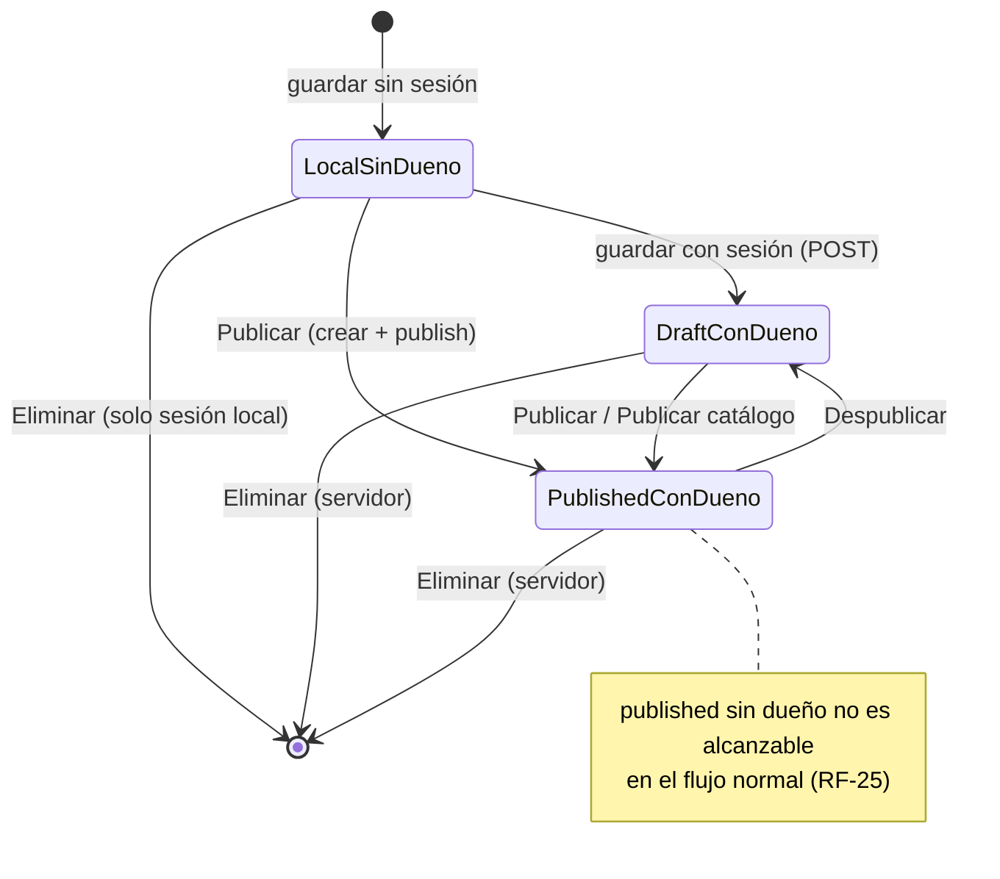

# UML 002 — Catálogo: ABM local, estados y publicación

Diagramas alineados con el plan de esta spec en `panel-web` (Angular 21, SPA standalone).

Los diagramas priorizan relaciones arquitectónicas y de flujo; no intentan listar cada import, tipo local o dependencia transitiva ya explicada por el estado, el cliente HTTP o el servicio dueño.

**Configuración:** `apiBaseUrl` = `environment.apiBaseUrl` (sin barra final), el mismo host configurado para todo el panel.

**Frontera HTTP (solo `{apiBaseUrl}/panel/catalog/*`, cookie `fes_session`):** `GET/POST /panel/catalog/products`, `PUT/DELETE /panel/catalog/products/{id}`, `POST /panel/catalog/products/{id}/publish`, `POST /panel/catalog/products/{id}/unpublish`, `POST /panel/catalog/publish`.

**Claves de `sessionStorage`:** `fes.catalog.products.local` (productos locales sin dueño), `fes.catalog.pending-operation` (intención para reintentar tras 401).

**Producto unificado (`CatalogProduct`):** `{ id, name, price, currency, stock?, stage: 'draft'|'published', owned: boolean, origin: 'local'|'server', images: ProductImage[], createdAt }`.

## Capas de componentes



## Estructura de carpetas (planificada)

```
src/app/
  app.ts / app.html                    # shell Admin UI + nav «Catálogo» + RouterOutlet
  app.routes.ts                        # lazy: catalog, catalog/new, catalog/:id/edit
  app.config.ts                        # provideRouter, provideHttpClient, provideAppInitializer
  core/
    components/
      confirm-dialog/                  # modal reutilizable
      product-images/                  # carousel + placeholder + límites de imágenes
      product-status/                  # badges de etapa y posesión
    constants/
      product-stage.ts                 # 'draft' | 'published'
      product-origin.ts                # 'local' | 'server'
      product-limits.ts                # MAX_IMAGES = 10 · MAX_IMAGE_BYTES = 2 MB
      catalog-storage-keys.ts          # claves de sessionStorage
    models/
      catalog-product.ts               # CatalogProduct · ProductImage · Currency
      pending-catalog-operation.ts     # intención tras 401
    services/
      catalog/
        catalog.ts                     # estado (signals) y acciones
        panel-catalog.ts               # cliente HTTP de la frontera
        local-catalog.ts               # persistencia sessionStorage
        catalog-recovery.ts            # reintento tras 401
  views/
    catalog-list/                      # /catalog
    catalog-form/                      # /catalog/new · /catalog/:id/edit
```

## Secuencia: guardar según sesión



## Secuencia: publicar catálogo (toma de posesión masiva)

```mermaid
sequenceDiagram
  participant User as Usuario
  participant List as CatalogListView
  participant Cat as Catalog
  participant Panel as PanelCatalog
  participant API as apiBaseUrl/panel/catalog
  participant Session as Session

  User->>List: «Publicar catálogo» (modal de confirmación)
  List->>Cat: publishCatalog()
  Note over Cat: draft visibles = locales sin dueño + draft con dueño de la cuenta

  loop cada local sin dueño
    Cat->>Panel: create(local + imágenes)
    Panel->>API: POST /panel/catalog/products
  end
  Cat->>Panel: publishCatalog()
  Panel->>API: POST /panel/catalog/publish<br/>(withCredentials, cookie fes_session)
  alt 2xx
    API-->>Panel: drafts publicados
    Panel-->>Cat: éxito
    Cat->>Cat: recargar productos del servidor; vaciar locales ya asociados
    Cat-->>List: todos los draft visibles quedan published con dueño
  else 401
    API-->>Panel: 401
    Cat->>Cat: handleUnauthorized(publishCatalog)
  else error
    API-->>Panel: 5xx / red
    Cat-->>List: aviso en español, sin perder datos locales
  end
```

## Secuencia: recuperación ante 401



## Secuencia: eliminar según posesión



## Relaciones de estado



## Estados de un producto


