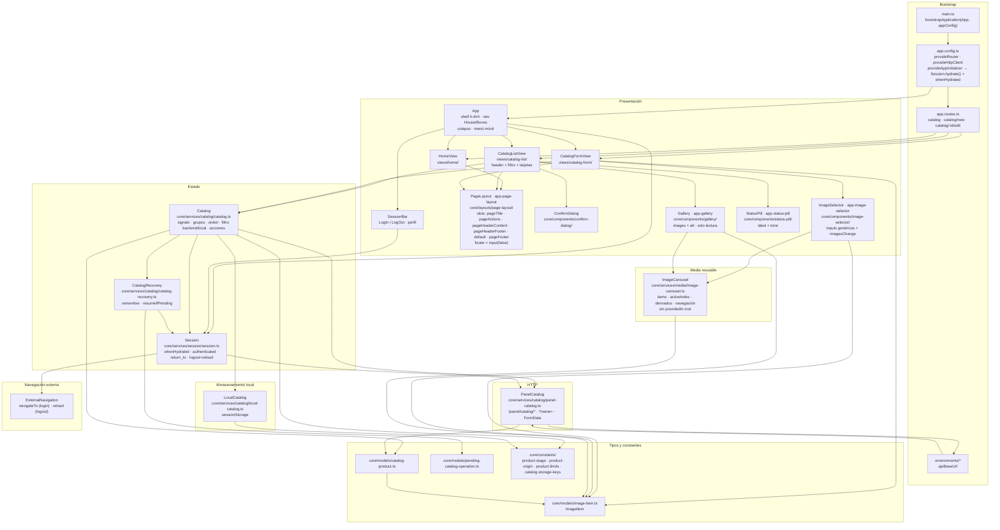
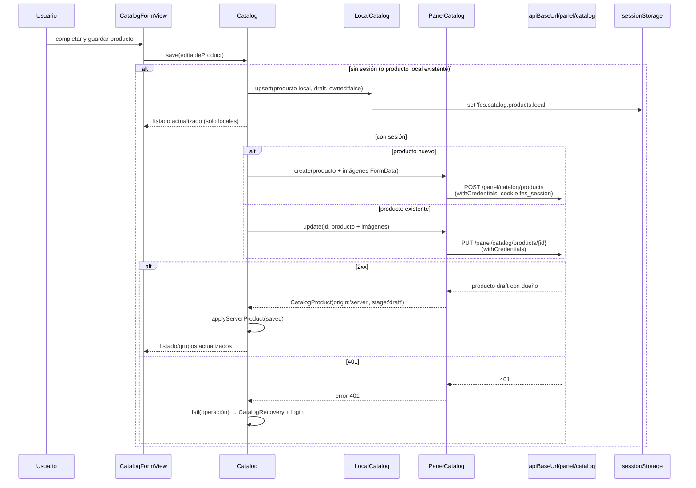
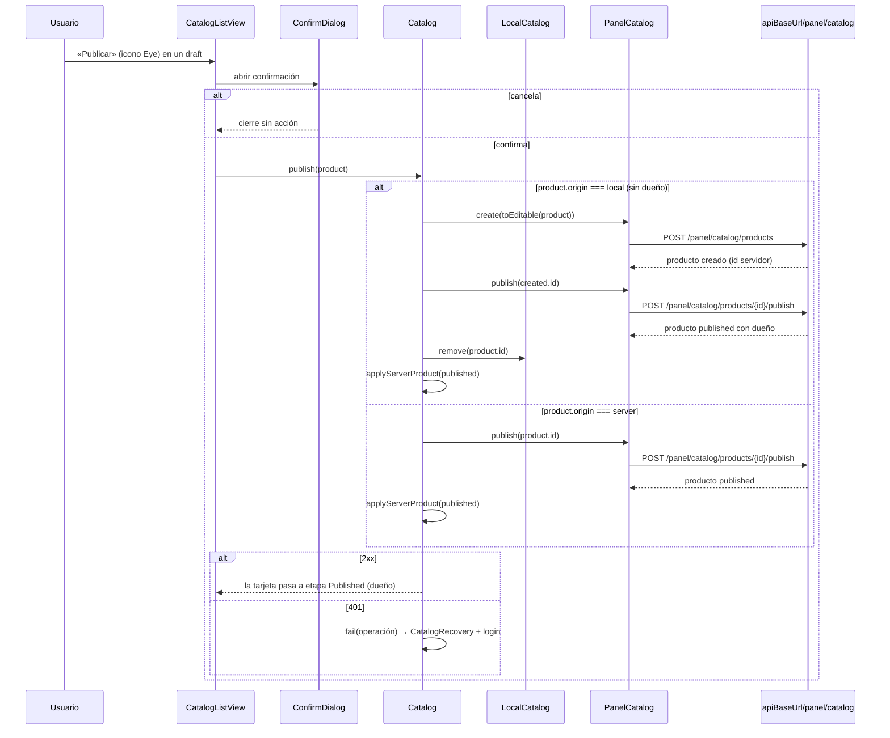
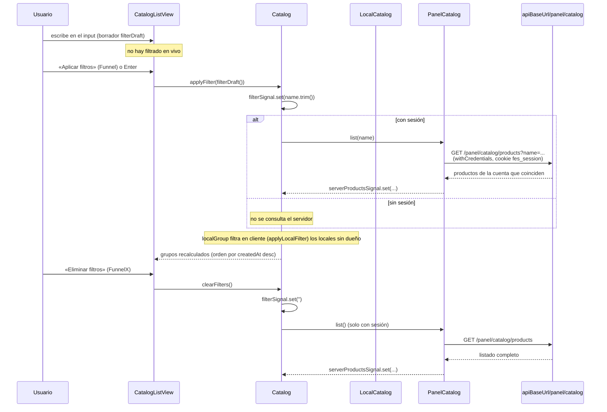
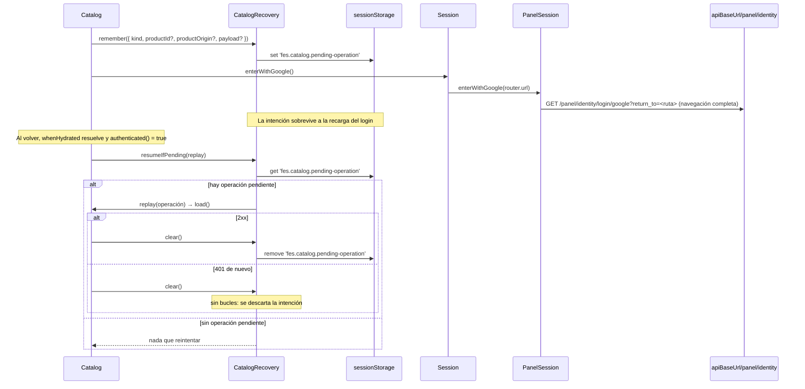
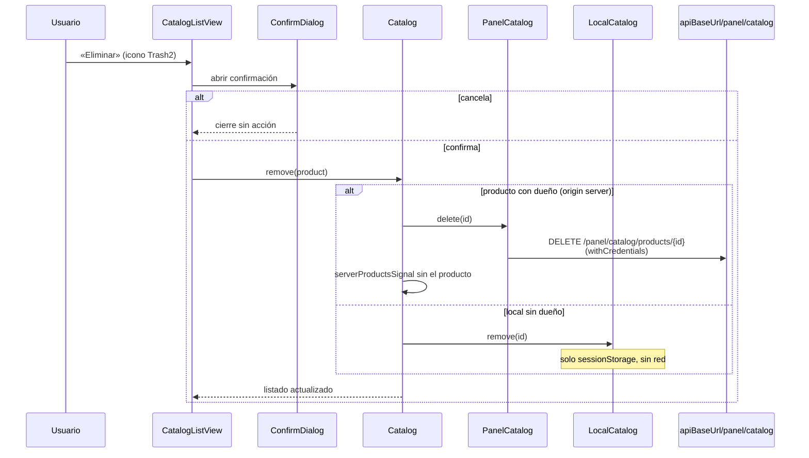
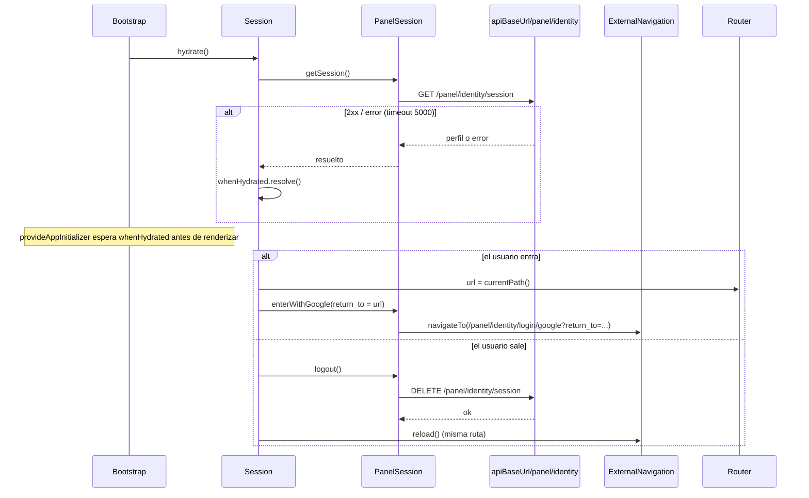
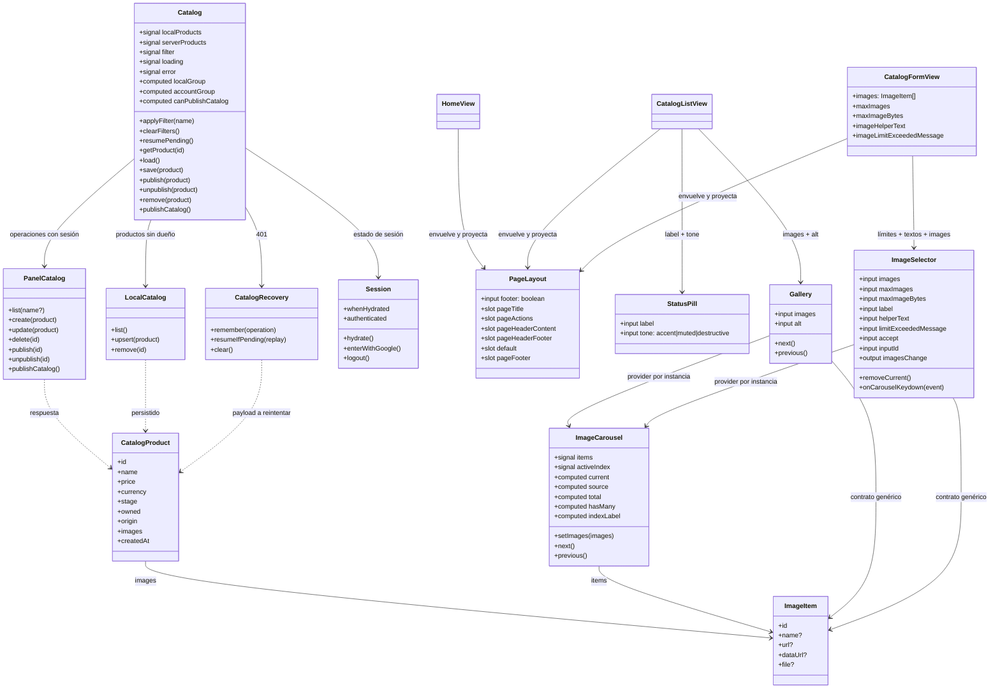
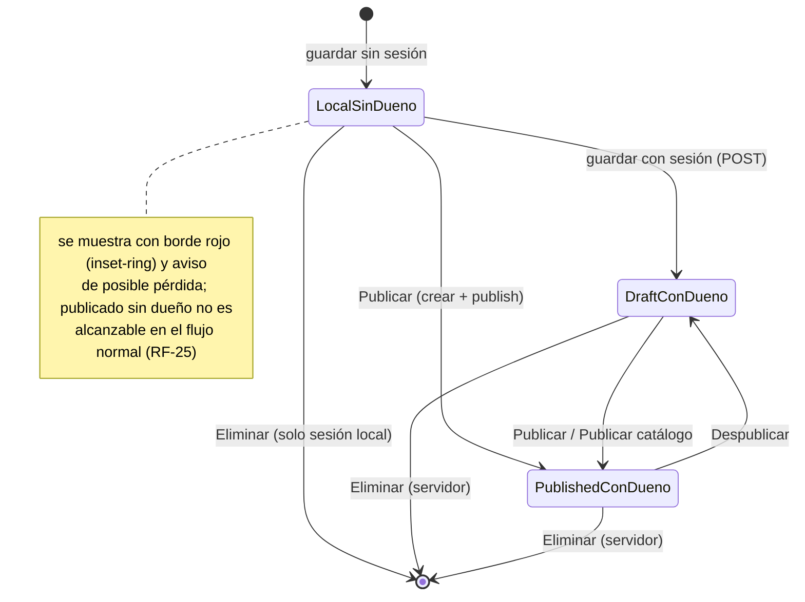

# UML 002 — Catálogo: ABM local, estados y publicación

Diagramas alineados con la implementación as-built de esta spec en `panel-web` (Angular 21, SPA standalone).

Los diagramas priorizan relaciones arquitectónicas y de flujo; no intentan listar cada import, tipo local o dependencia transitiva ya explicada por el estado, el cliente HTTP o el servicio dueño.

**Configuración:** `apiBaseUrl` = `environment.apiBaseUrl` (sin barra final), el mismo host configurado para todo el panel.

**Frontera HTTP (solo `{apiBaseUrl}/panel/catalog/*`, cookie `fes_session`):** `GET /panel/catalog/products` (con `?name=...` opcional), `POST /panel/catalog/products`, `PUT/DELETE /panel/catalog/products/{id}`, `POST /panel/catalog/products/{id}/publish`, `POST /panel/catalog/products/{id}/unpublish`, `POST /panel/catalog/publish`.

**Claves de `sessionStorage`:** `fes.catalog.products.local` (productos locales sin dueño), `fes.catalog.pending-operation` (intención para reintentar tras 401).

**Producto unificado (`CatalogProduct`):** `{ id, name, price, currency, stock?, stage: 'draft'|'published', owned: boolean, origin: 'local'|'server', images: ImageItem[], createdAt }`. `EditableProduct` también usa `ImageItem[]`, donde `ImageItem = { id, name?, url?, dataUrl?, file? }`.

## Capas de componentes



## Estructura de carpetas (as-built)

```
src/app/
  app.ts / app.html                    # shell h-dvh + nav House/Boxes + colapso + header móvil + RouterOutlet
  app.routes.ts                        # lazy: catalog, catalog/new, catalog/:id/edit
  app.config.ts                        # provideRouter, provideHttpClient, provideAppInitializer(whenHydrated)
  core/
    layouts/
      page-layout/                     # PageLayout · app-page-layout · header fijo + scroll + footer opcional
    components/
      confirm-dialog/                  # modal reutilizable
      gallery/                         # Gallery · app-gallery · solo lectura
      image-selector/                  # ImageSelector · app-image-selector · selección/validación genérica
      status-pill/                     # StatusPill · app-status-pill · label + tone
      session-bar/                     # control de sesión (entrar/salir)
    constants/
      product-stage.ts                 # 'draft' | 'published'
      product-origin.ts                # 'local' | 'server'
      product-limits.ts                # MAX_IMAGES = 10 · MAX_IMAGES_WITHOUT_SESSION = 1 · MAX_IMAGE_BYTES = 2 MB
      catalog-storage-keys.ts          # claves de sessionStorage
      session-status.ts                # 'anonymous' | 'authenticated'
    models/
      catalog-product.ts               # CatalogProduct · Currency · EditableProduct (ImageItem[])
      image-item.ts                    # ImageItem { id, name?, url?, dataUrl?, file? }
      pending-catalog-operation.ts     # intención tras 401
    services/
      navigation/
        external-navigation.ts         # navigateTo + reload
      session/
        session.ts                     # signals, whenHydrated, return_to, logout+reload
        panel-session.ts               # HTTP /panel/identity/*
      catalog/
        catalog.ts                     # estado (signals) y acciones
        panel-catalog.ts               # cliente HTTP de la frontera
        local-catalog.ts               # persistencia sessionStorage
        catalog-recovery.ts            # reintento tras 401
      media/
        image-carousel.ts              # estado reusable, provisto por cada componente consumidor
  views/
    home/                              # /
    catalog-list/                      # /catalog
    catalog-form/                      # /catalog/new · /catalog/:id/edit
```

## Estructura de `PageLayout` (entre el shell y las vistas)

`App` renderiza el `<router-outlet />`; cada vista (`HomeView`, `CatalogListView`, `CatalogFormView`) envuelve su contenido en `<app-page-layout>` (selector `app-page-layout`, input `footer = input(false)`) y proyecta por slots. El layout no conoce el catálogo ni la sesión: solo organiza el marco de la página.

| Zona | Slot | Contenido | Tamaño |
|------|------|-----------|--------|
| Header, fila 1 izquierda | `[pageTitle]` | Título de la vista | Máx. 80% de ancho |
| Header, fila 1 derecha | `[pageActions]` | Acciones principales | Ancho automático |
| Header, fila 2 | `[pageHeaderContent]` | Filtros u otro contenido de header | 100% de ancho |
| Header, fila 3 | `[pageHeaderFooter]` | Reservado | 100% de ancho |
| Cuerpo | default | Contenido principal scrolleable | `flex-1` (80% si hay footer, 100% si no) |
| Footer | `[pageFooter]` | Navegación/acciones en pantallas chicas (reservado) | `h-1/5`, 100% de ancho, visible con `[footer]="true"` |

El header es fijo (`shrink-0`, con borde inferior); el cuerpo scrollea (`overflow-y-auto`) y concentra el padding inferior; el footer es opcional y fijo. Las vistas definen su host como `flex min-h-0 flex-1 flex-col` y ya no replican header, scroll ni padding.

## Secuencia: guardar según sesión



## Secuencia: publicar un producto



## Secuencia: filtrar por nombre (backend + locales)



## Secuencia: publicar catálogo (toma de posesión masiva)

```mermaid
sequenceDiagram
  participant User as Usuario
  participant List as CatalogListView
  participant Cat as Catalog
  participant Panel as PanelCatalog
  participant API as apiBaseUrl/panel/catalog

  User->>List: «Publicar catálogo» (modal de confirmación)
  List->>Cat: publishCatalog()
  Note over Cat: draft visibles = locales sin dueño + draft con dueño de la cuenta

  loop cada local sin dueño
    Cat->>Panel: create(toEditable(local))
    Panel->>API: POST /panel/catalog/products
  end
  Cat->>Panel: publishCatalog()
  Panel->>API: POST /panel/catalog/publish<br/>(withCredentials, cookie fes_session)
  alt 2xx
    API-->>Panel: drafts publicados
    Panel-->>Cat: éxito
    Cat->>Cat: quitar locales asociados; recargar productos del servidor
    Cat-->>List: todos los draft visibles quedan published con dueño
  else 401
    API-->>Panel: 401
    Cat->>Cat: fail(publishCatalog) → CatalogRecovery + login
  else error
    API-->>Panel: 5xx / red
    Cat-->>List: aviso en español, sin perder datos locales
  end
```

## Secuencia: recuperación ante 401



## Secuencia: eliminar según posesión



## Secuencia: arranque, login y logout de sesión



## Relaciones de clases



## Estados de un producto


